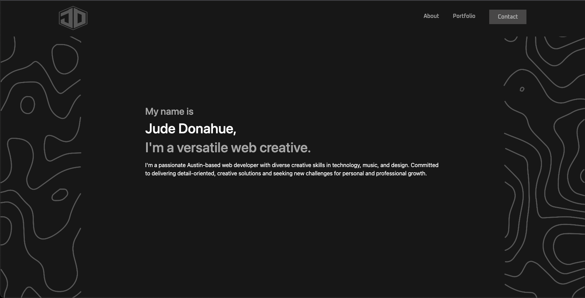
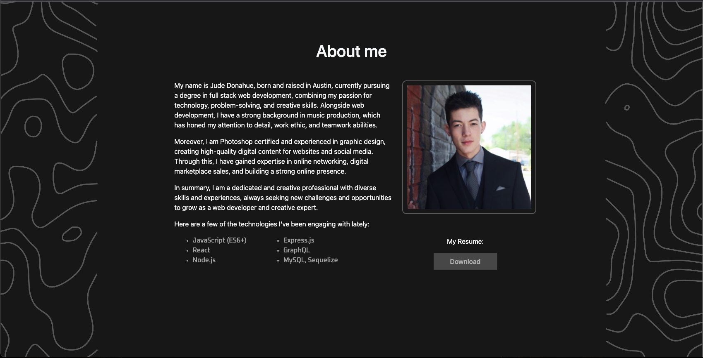
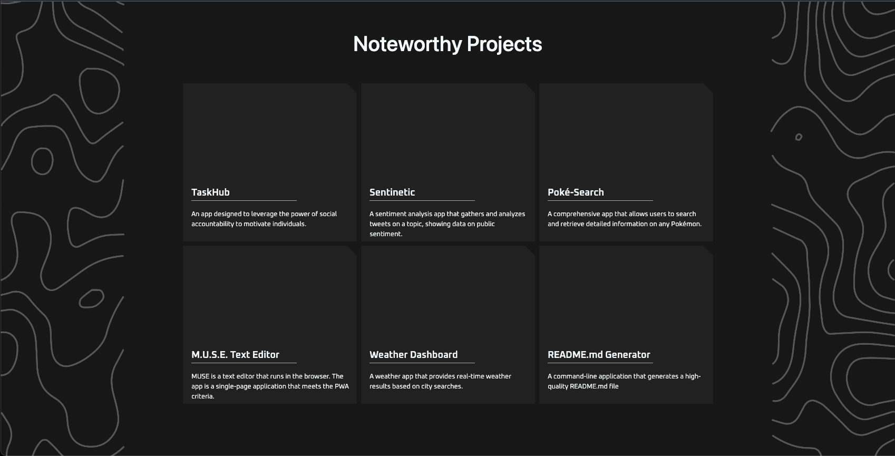

# < Portfolio >  

## Description
Portfolio page built using React. A dynamic and modern website that showcases my professional achievements, projects, and skills. It features a clean layout with interactive elements, presenting my completed works, technical competencies, and work experience. The page is responsive and user-friendly, providing a captivating digital resume to potential employers and collaborators.

## Table of Contents

- [Installation](#Installation)

- [Usage](#Usage)

- [License](#License)

- [Credits](#Credits)

- [Tests](#Tests)

- [Questions](#Questions)

## Installation
[Deployed-Portfolio](https://judemdonahue.github.io/REACT-portfolio/)

## Technologies Used

## Usage

## License
This application is covered under the MIT License.

## Questions
Please don't hesitate to reach out to me if you have any queries, you can do so by contacting me through my GitHub profile [judemdonahue](https://github.com/judemdonahue) or by sending an email to judemdonahue@gmail.com.

